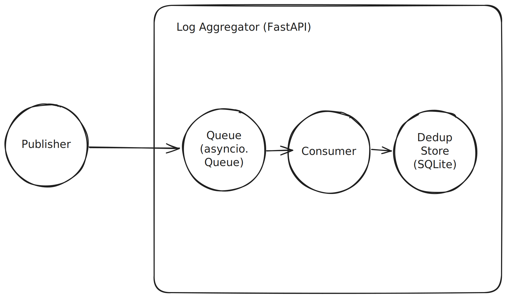

# UTS Sistem Paralel dan Terdistribusi: Pub-Sub Log Aggregator dengan Idempotent Consumer dan Deduplication

## Identitas

- Nama: Ilham Al Basith
- NIM: 11221077
- Program Studi: Informatika

## Ringkasan Sistem dan Arsitektur

Dalam sistem Pub-Sub Log Aggregator ini, service-service yang biasanya disebut Publisher dapat mengirimkan event dalam bentuk singular maupun batched ke API Aggregator. Selanjutnya, Aggregator akan menyimpan setiap event ke internal queue. Consumer (Subscriber) akan mengambil event dari queue, melakukan deduplication yang akan memberhentikan pemrosesan jika terdeksi duplikat. Jika bukan maka akan disimpan ke dedup store berbasis SQLite dan ditambahkan pada log.

## Keputusan Desain

## Analisis Performa dan Metrik

## Keterkaitan ke BAB 1-7

### T1
Sistem terdistribusi yang baik harus memenuhi beberapa karakteristik desain. Suatu sistem terdistribusi harus memudahkan akses terhadap sumber daya; menyembunyikan fakta bahwa sumber daya terdistribusi terhadap suatu jaringan; harus terbuka; dan harus scalable (Steen & Tanenbaum, 2023). Berbagi sumber daya (resource sharing) pada sistem terdistribusi tidak hanya bertujuan untuk aspek ekonomis saja namun juga memudahkan pengguna untuk berkolaborasi dan bertukar informasi (Steen & Tanenbaum, 2023). Karakteristik yang memudahkan pengguna dalam menggunakan suatu sistem terdistribusi adalah transparansi. Transparansi akan menyembunyikan fakta bahwa sistem terpisah secara fisik bahkan mungkin sangat berjauhan. Keterbukaan akan memudahkan penggunaan atau integrasi komponen-komponen ke sistem lain. Selain itu, tentu saja sistem terdistribusi harus bersifat scalable yaitu dengan menambahkan sumber daya, sistem harus dapat menerima pekerjaan yang lebih banyak tanpa menurunkan performa.
Salah satu arsitektur sistem terdistribusi adalah publish-subscribe (pub-sub) dimana terdapat publisher mengirim event ke sistem dan terdapat subsriber yang berlangganan kepada sistem untuk mendapatkan event. Pada log aggregator yang berbasis topic-based pub-sub tentu memiliki trade-off. Salah satu nya adalah penamaan topic dimana jika terlalu banyak topic terlalu spesifik maka pencarian log akan menyusahkan, namun jika topic terlalu umum maka memungkinkan event yang sangat banyak di topic tersebut. Deduplication juga menjadi trade-off terhadap seberapa banyak event yang dapat diterima dalam suatu periode. Selain itu, fault tolerance juga meningkatkan kompleksitas dari sistem.

### T2
Dalam arsitektur client-server, proses dalam sistem terbagi menjadi 2: server yang mengimplementasikan suatu layanan seperti layanan file system atau database dan client yang mengirim request ke suatu layanan di suatu server dan menunggu balasan (reply/response) dari server (Steen & Tanenbaum, 2023). Pada log aggregator, client akan mengirimkan log dan menunggu hingga log berhasil diproses untuk mendapatkan response. Ini akan meningkatkan latency, apalagi setelah ditambahkan deduplication. Untuk menambahkah deduplication dalam arsitektur ini juga menantang sehingga meningkagkan kompleksitas.
Berbeda dengan client-server, arsitektur pub-sub menggabungkan shared data space dan event-based coordination dimana suatu proses berlangganan (subscribe) ke suatu tuple dengan memberikan search pattern dan saat suatu proses menambahkan tuple ke data space, subscriber akan diberitahu (Steen & Tanenbaum, 2023). Pada konteks log aggregator, publisher akan mengirimkan log event dan langsung diberitahu saat event telah masuk dalam queue. Sehingga latency sangatlah kecil dan queue memudahkan implementasi deduplication.
Untuk sistem terdistribusi dalam skala kecil dan tidak sibuk, mungkin client-server saja cukup. Namun semakin besar dan sibuk sistem, tentunya pub-sub menjadi opsi yang trivial.

### T3
At-least-once semantics adalah teknik yang menjamin suatu RPC dikirimkan setidaknya sekali, dan kemungkinan lebih (Steen & Tananenbaum, 2023).

### T4

### T5

### T6

### T7

### T8

## Referensi
