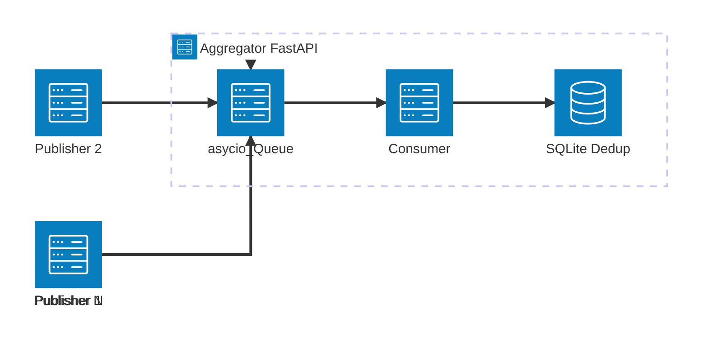

# UTS Sistem Terdistribusi dan Paralel: Pub-Sub Log Aggregator dengan Idempotent Consumer dan Deduplication

## Identitas

- Nama: Ilham Al Basith
- NIM: 11221077
- Program Studi: Informatika

## Ringkasan Sistem dan Arsitektur

## Keputusan Desain

## Analisis Performa dan Metrik

## Keterkaitan ke BAB 1-7

## Referensi
